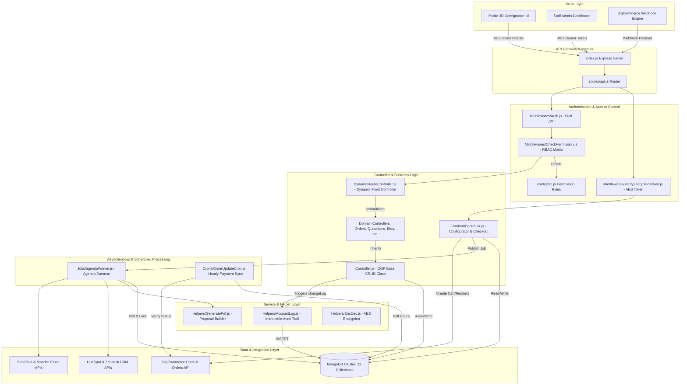

# RSA (Roofing & Siding Architecture) — Master Developer Documentation & Onboarding Portal

Welcome to the **RSA Backend Technical Documentation Suite**. This document serves as the primary entry point and executive onboarding summary for new software engineers, DevOps specialists, and technical architects joining the Roofing & Siding system development team.

---

## 📚 Exhaustive Documentation Suite (The 4-Part Architecture Library)

To ensure zero truncation and 100% comprehensive coverage of every file, function, database model, API endpoint, and workflow in the system, our developer documentation is organized into **4 exhaustive reference volumes**. 

You can access the detailed volumes directly from the system artifacts library or your local IDE documentation directory:

| Volume | Title & Topics Covered | Artifact / Document Path |
| :--- | :--- | :--- |
| **Part 1** | **Developer Onboarding & Architecture Guide**<br>• Project Overview & Purpose<br>• High-Level & MVC Architecture<br>• Folder Structure & Directory Tree<br>• Coding Standards & Best Practices<br>• Local Development & Setup Guide | `.gemini/antigravity-ide/brain/.../developer_onboarding_and_architecture.md` |
| **Part 2** | **Codebase Reference & Services Guide**<br>• **All 62 Backend Files Documented** (Responsibilities, Imports/Exports, Logic, Suggestions)<br>• **All 12 Database Schemas** (Deep-dive Mongoose ODM, soft deletion, audit logging)<br>• Service Layer & Helpers (PDF generation, encryption, Excel export, uploader)<br>• Middleware Architecture & Utility Functions | `.gemini/antigravity-ide/brain/.../codebase_reference_and_services.md` |
| **Part 3** | **API Reference & Sequence Diagrams Guide**<br>• **All 25 REST API Endpoints Documented** (Method, URL, Auth, Request/Response payloads, Validation, DB tables, Third-party APIs)<br>• **6 Core System Sequence Diagrams** (Mermaid diagrams for Request flow, Auth, DB audit logging, Crons, Agenda queues, Webhooks) | `.gemini/antigravity-ide/brain/.../api_reference_and_sequence_diagrams.md` |
| **Part 4** | **Workflows, Guides & Troubleshooting**<br>• Step-by-Step Business Logic Walkthroughs in Simple English<br>• End-to-End Code Walkthrough (`POST /api/quotation/create`)<br>• Component Dependency Graph (Mermaid)<br>• Common Developer Tasks (How to add API, Model, Controller, Job, Cron)<br>• Troubleshooting Tables, FAQ, and Actionable Future Roadmap | `.gemini/antigravity-ide/brain/.../workflows_guides_and_troubleshooting.md` |

---

## 🚀 Executive System Overview

### What is the RSA System?
The **RSA (Roofing & Siding Architecture)** platform is an enterprise-grade web configurator, architectural quotation calculator, and e-commerce integration engine built for the commercial and residential roofing industry.

It allows website visitors and contractors to:
1. Input building dimensions (square footage, roof pitch, number of stories).
2. Configure architectural materials, colors, and underlayments in real time.
3. Automatically calculate ADA compliance surcharges and radial distance-based installation labor costs.
4. Generate instant branded PDF proposals and push sales leads into enterprise CRMs (**HubSpot** and **Zendesk**).
5. Bridge quotes directly into **BigCommerce** shopping carts for immediate online credit card checkout.

### Core Tech Stack
- **Runtime:** Node.js (v16+)
- **Framework:** Express.js (v4.18+)
- **Database:** MongoDB (via Mongoose ODM v8)
- **Job Scheduler:** Agenda.js (MongoDB-backed asynchronous queue)
- **Cron Engine:** Node-Cron (Scheduled hourly/daily batch tasks)
- **PDF Generation:** PDFMake & jsPDF
- **E-Commerce / CRM Integrations:** BigCommerce API, HubSpot CRM API, Zendesk API, SendGrid / Mandrill SMTP

---

## 🏗️ High-Level Architectural Diagram

The system follows a **Modified Model-View-Controller (MVC)** pattern augmented with a **Dynamic Front Controller Engine**, **Asynchronous Background Worker Queues**, and **Real-Time E-Commerce Webhooks**.



---

## ⚡ 5-Minute Quick-Start Onboarding Checklist

1. **Clone & Install:**
   ```bash
   git clone <repository-url>
   cd RSA/backend
   npm install
   ```
2. **Environment Configuration (`.env`):**
   Ensure your local `.env` file includes:
   ```env
   PORT=4000
   DB_URI=mongodb://localhost:27017/rsa_db
   JWT_SECRET_KEY=your_super_secret_jwt_key
   ENCRYPT_KEY=your_32_character_aes_secret_key
   BIGCOMMERCE_API_TOKEN=your_token
   BIGCOMMERCE_STORE_HASH=your_store_hash
   SENDGRID_API_KEY=your_sendgrid_key
   ```
3. **Start the API Server:**
   ```bash
   npm start
   # Output: Connected to DB
   # Output: Server running on port 4000
   ```
4. **Start the Agenda Background Worker (In a separate terminal):**
   ```bash
   node Jobs/agendaWorker.js
   # Output: Agenda worker started and listening for jobs...
   ```
5. **Start Scheduled Crons (In a separate terminal or via PM2):**
   ```bash
   node Crons/OrderUpdateCron.js
   ```

---
*For detailed file breakdowns, database schemas, API payloads, sequence diagrams, and troubleshooting guides, open the corresponding documentation volumes listed in the table above!*
